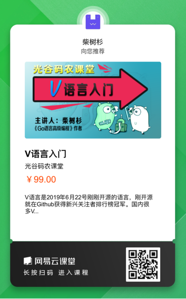

# V语言资料精选

V语言是为开发可维护的软件而创建的简单、快速、安全的编程语言。

## 官网资料

- 语言官网：https://vlang.io
- 官方代码：https://github.com/vlang

## V语言中文网

- 中文主页：https://vlang-zh.cn
- 中文代码：https://github.com/vlang-zh
- V语言教程：https://vlang-zh.cn/docs.html
- V语言教程（高级主题）：https://vlang-zh.cn/docs_advanced.html
- V语言实例：https://github.com/vlang-zh/v-examples
- V语言案例：https://vlang-zh.cn/apps.html
- FAQ：https://vlang-zh.cn/faq.html

QQ群和微信群：

- V语言QQ群：878358520
- V语言微信群请关注“光谷码农”微信公众号，然后从底部菜单进群。

## 安装V语言

从代码编译V语言：

https://github.com/vlang/v#installing-v-from-source

Docker环境：

```
$ docker pull xena/vlang:0.0.12

$ docker run --rm -it xena/vlang:0.0.12 sh
$ docker run --rm -it xena/vlang:0.0.12 /root/code/v/compiler/v

$ docker run --rm -it xena/vlang:0.0.12 /root/code/v/compiler/v run /root/code/v/examples/hello_world.v
```

## 网易云课堂视频教程：[V语言入门](https://study.163.com/course/courseMain.htm?share=2&shareId=480000001914454&courseId=1209408820&_trace_c_p_k2_=e3d8df173a5d439eafd42b313f0aed0c)




----


